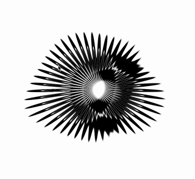
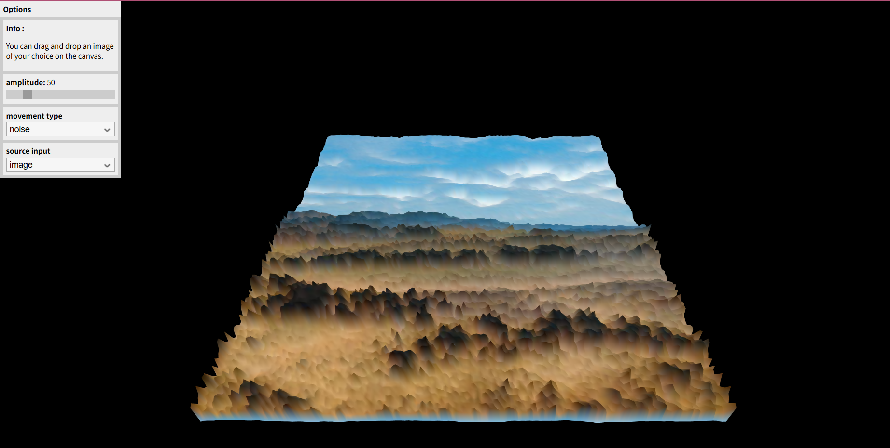

# Quiz 8 – Design Research,
## Part 1: Imaging Technique Inspiration,
I was inspired by the fluid transitions on the Web Animations API demo site (mozdevs Animation-examples). The easing curves, staggered timing, and motion paths make UI changes feel like a continuous story rather than abrupt replacements. I want to adopt this “motion narrative” mindset in my project: scene changes or interface states should flow seamlessly, creating spatial cohesion and emotional pacing.

## Part 2: Coding Technique Exploration,
To realize this, I will use the Web Animations API in JavaScript. It supports keyframe definitions, timing options (duration, delay, easing), playback controls (pause, reverse) and chaining. This lets me script smooth transitions between UI states or components in a well-coordinated way.

!Example Code / Repo: b2renger/p5js-shaders